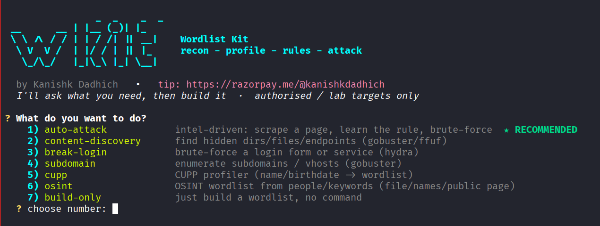

# wlkit — Wordlist Kit

[](https://pypi.org/project/wordlist-kit/)
[](https://pypi.org/project/wordlist-kit/)
[](LICENSE)
[](https://pypi.org/project/wordlist-kit/)

**One CLI that goes from a URL to a targeted wordlist to a ready-to-run attack.**
Consolidates crunch, CeWL, CUPP, username-anarchy and hashcat/john-style rules —
plus recon, OSINT, and gobuster/ffuf/hydra command assembly — into a single tool
with an interactive menu. Educational / **authorised-testing use only**.

```bash
pip install wordlist-kit   # then just run:  wlkit
```



**Author:** Kanishk Dadhich
· [GitHub](https://github.com/kanishk-dadhich)
· [X](https://x.com/whotfbunny)
· [LinkedIn](https://www.linkedin.com/in/kanishk-dadhich)
· [kanishkdadhich123@gmail.com](mailto:kanishkdadhich123@gmail.com)

☕ **Found it useful? Tip the author:** https://razorpay.me/@kanishkdadhich
(`wlkit about` shows this any time.)

## Install
```bash
pip install wordlist-kit           # from PyPI
# or from source:
git clone https://github.com/kanishk-dadhich/wlkit && cd wlkit && pip install .
```
Then run `wlkit` for the interactive menu, or `wlkit <subcommand>`.

**Optional external tools** (wlkit builds/assembles commands for these; install what you use):
`hydra`, `gobuster`, `ffuf`, and `theHarvester` (for `osint --import`).

> ⚠️ **Authorised testing only.** Use wlkit exclusively against systems you own or are
> explicitly permitted to test. You are responsible for how you use it.


| Subcommand | Replaces | What it does |
|------------|----------|--------------|
| `gen`      | crunch   | Pattern (`@`,`` ` ``,`%`,`^`) or charset+length brute generation |
| `extract`  | CeWL     | Unique words from text/HTML (`--strip-html`) |
| `profile`  | CUPP     | Personalised list from names/dates/pets (+`--combine`, `--leet`) |
| `users`    | username-anarchy | `first.last`, `jsmith`, `smithj`… from full names |
| `mutate`   | john/hashcat rules | `--case --leet --append --prepend` on an existing list |
| `combine`  | sort -u  | Merge/dedupe, `--sort` or `--by-frequency` |
| `use`      | —        | Build a gobuster/ffuf/hydra command from a wordlist (prints; `--run` to execute) |
| `wizard`   | —        | **Interactive** — asks what you need, builds the list, then prints/runs the command |
| `auto`     | —        | **Thinking mode** — give a URL; it reasons about the login, builds both lists, assembles hydra |
| `harvest`  | —        | Scrape a URL (`--cookie` for authed pages) → `users.txt` + ranked `passwords.txt` |
| `cupp`     | CUPP     | Faithful port of Mebus/cupp — profile → wordlist (interactive / flags / from-URL) |

## Consume theHarvester output (`osint --import`)
`wlkit` doesn't run recon tools itself — it consumes their output. Run
[theHarvester](https://github.com/laramies/theHarvester) yourself, then import its
JSON: `osint` parses **emails, subdomains, and names** natively into keywords,
people, and (with `--users`) a usernames file.
```bash
theHarvester -d acme.com -b crtsh,otx,certspotter -f acme     # writes acme.json
wlkit osint --import acme.json --company acme --users users.txt -o acme.txt
```
Emails → username schemes (`marco.bianchi`, `mbianchi`), subdomain labels →
keywords (`jira` → `Jira2024!`), names → per-person CUPP. Same result as a built-in
runner, without the dependency or coupling.

## OSINT wordlist from people/keywords (`osint`)
Turns OSINT you already have — an exported employee file, inline names, or a
**public** page (team/about) — into a ranked, target-specific wordlist using the
CUPP + template engines. It does **not** log into or scrape ToS-protected
platforms (LinkedIn, etc.); point it at data you've lawfully collected or a public
page.
```bash
wlkit osint --names 'John Smith, Jane Doe' --company acme --leet -o acme.txt
wlkit osint --import employees.csv --company acme --big -o acme.txt
wlkit osint --from-url https://acme.com/team --company acme -o acme.txt
```
Sources combine: emails → name schemes, "First Last" names (nav/label noise
filtered), badge/tag keywords, dates. `--import` also harvests **skills / interests
/ tools** from a profile export as keywords (`bugbounty` → `Bugbounty2024!`).

**LinkedIn / social profiles** can't be fetched with `--from-url`: they block
automated requests and render the profile with JavaScript, so the HTML has no
usable fields (and automating with your session cookie risks the account). Export
the profile and import it instead:
```bash
# browser -> the profile -> More -> Save to PDF   (your own data)
pdftotext profile.pdf profile.txt
wlkit osint --import profile.txt --company <employer> --leet -o out.txt
``` Output is ranked most-likely-first:
company/keywords, then `Keyword+Year+!` (the common human pattern), then per-person
CUPP, then name×date. `--deep` adds special chars + random numbers, `--big`
expands numbers 0–100. Also in the interactive menu (option **osint**).

**Feed an OSINT list into an attack.** Both `auto` and `harvest` take `--osint FILE`:
```bash
wlkit osint --import employees.csv --company acme -o acme.txt
wlkit auto login.acme.com --osint acme.txt --user marco --run          # uses it as the list
wlkit auto ssh.acme.com --service ssh --osint acme.txt --make-wordlist  # prepended high-priority
wlkit harvest https://acme.com --osint acme.txt --passwords pw.txt      # prepended before scraped pw
```
In `auto` it becomes the password list (or, with `--make-wordlist`, is prepended
ahead of the built candidates); in `harvest` it's prepended to the passwords file.

## CUPP mechanism — profile → wordlist (`cupp`)
A faithful port of [Mebus/cupp](https://github.com/Mebus/cupp)'s
`generate_wordlist_from_profile` — **verified byte-identical** to upstream across
all toggle combinations. Same birthday-fragment expansion, name/surname/nick
pairing (with cupp's case-variant guard), partner/child/pet/company combos,
year/number/special-char appends, and leet.
```bash
# interactive (like cupp -i)
python3 wlkit.py cupp -i

# from flags
python3 wlkit.py cupp --name marco --surname bianchi --nick marky \
   --birthdate 14021995 --special --randnum --leet -o marco.txt

# auto-fill the profile straight from an authenticated profile page
python3 wlkit.py cupp --from-url http://10.49.152.19:5002/profile \
   --cookie 'jobs_authed=1' --special --randnum --leet -o marco.txt
```
`--special` appends special-char combos, `--randnum` appends `numfrom..numto`,
`--leet` adds leetspeak. Config knobs: `--years`, `--numfrom/--numto`,
`--wcfrom/--wcto` (cupp keeps words with `wcfrom < len < wcto`). Defaults mirror
`cupp.cfg` (years 1990–2022, chars `! @ '#' $ % & *`, len 6–11).

## Just run `wlkit` — it asks you (menu-first)
```bash
wlkit            # no arguments -> interactive menu, asks for everything
```
The menu covers every workflow through prompts (no flags to remember):
- **auto-attack** — asks service (web/ssh/…), target, an intel page + Host header,
  a login cookie, username, then scrapes → learns the rule → builds → runs hydra
- **content-discovery**, **break-login**, **subdomain**, **cupp**, **build-only**

The flag forms below still work for scripting, but you never *need* them —
`wlkit` (or `wlkit wizard`) will ask.

## Turn a login session into `users.txt` + `passwords.txt` (`harvest`)
```bash
python3 wlkit.py harvest http://10.49.152.19:5002 \
   --cookie 'session=...; jobs_authed=1' \
   --users users.txt --passwords passwords.txt
```
- **usernames** ← names/emails from team/about/profile pages → username formats
  (`marco.bianchi`, `mbianchi`, `marco`, …), field-label/nav noise filtered out
- **passwords** ← personal data mined from the *authenticated* profile page
  (names, nickname, **birthdate**), ranked most-likely-first
  (`marco` → `marco1995` → `marco14021995` → partials), then the site's mutated
  keywords appended
- personal data is only mined from authed/profile pages (never the marketing
  homepage), so the high-priority guesses stay genuinely personal

Then feed both to hydra:
```bash
python3 wlkit.py use hydra http-post-form passwords.txt --target 10.49.152.19 \
   --port 5002 --userlist users.txt --path /login \
   --body 'username=^USER^&password=^PASS^' --fail 'F=Invalid credentials'
```

## Zero questions — just point it at a URL (`auto`)
```bash
python3 wlkit.py auto http://10.49.152.19:5003          # reason + build, print command
python3 wlkit.py auto http://10.49.152.19:5003 --run    # ...and execute it
python3 wlkit.py auto http://site/login --user marco    # skip username reasoning
```
**Authenticated scraping** — some data (a profile page with a nickname, birthdate,
department) only shows *after* login. Pass a session cookie and the tool reads
those pages for wordlist material, while still reconning the login form
anonymously (logged-in users get redirected off `/login`):
```bash
python3 wlkit.py auto http://10.49.152.19:5002 --user marco --cookie 'jobs_authed=1'
python3 wlkit.py extract http://10.49.152.19:5002/profile --cookie 'session=...; jobs_authed=1'
```
Grab the cookie from your browser devtools (Application → Cookies) or a `Set-Cookie`
after logging in with a low-priv test account. The `wizard` scrape step also asks
"does the page need login?" and takes a cookie.

**Personal-data / birthdate mining (CUPP-style).** When `auto` reaches an
authenticated profile/account page, it doesn't just grab words — it extracts
**dates** and derives fragments, then combines them with names/nicknames:
- `14021995` (DDMMYYYY) → `14021995`, `1402`, `1995`, `95`, `140295`, `021995`, …
- names/nickname (`Marco`, `Bianchi`, `marky`) × those fragments × case/leet/suffix
- → `marky1995`, `marco140295`, `bianchi1995`, `Marco1995`, `marky95`, `14021995` …

These are **prepended** as high-priority guesses ahead of the generic keyword list,
because a password built from someone's own birthday is far likelier than a random
site word. Handles separated dates (`14/02/1995`), compact `DDMMYYYY`/`YYYYMMDD`,
`DDMMYY`, and standalone years.

**Wordlist source:** by default `auto` uses **rockyou.txt** — it does *not* build a
custom list unless you ask. Add `--make-wordlist` to build a targeted list from
the intel/rule/personal data instead, or `--wordlist FILE` to use your own. In the
interactive menu it simply asks: *rockyou / build a targeted list / use a file.*
```bash
wlkit auto 10.48.177.73 --service ssh --user marco                 # -> rockyou.txt
wlkit auto 10.48.177.73 --service ssh --user marco \
     --intel-url http://10.48.177.73:5000/ --make-wordlist          # -> targeted build
```

`auto` narrates its reasoning like an operator would, then acts:
- **RECON** — probes `/login`, `/admin`, `/signin`, … to find the form (path, method, field names)
- **failure signal** — sends one wrong login to learn the `F=` marker
- **username** — uses `--user`; else reads a concrete placeholder (e.g. `marco`);
  else scrapes team/about pages for names+emails; else falls back to a common-admin list
- **passwords** — hypothesises "keywords from the site's own words", scrapes them,
  then applies mutation rules (case/leet/+year/+numbers) unless `--no-mutate`
- **assemble** — builds the exact `hydra http-(post|get)-form` command and reports the search space

## Don't know which command? Just ask it (`wizard`)
```bash
python3 wlkit.py wizard
```
It walks you through menus — goal (content discovery / break login / subdomains /
build-only), how to build the wordlist (scrape / profile / merge / existing /
rockyou), and the target details — then prints the exact gobuster/ffuf/hydra
command and offers to run it (asks for a `yes` first). Everything below is the
manual equivalent if you'd rather type it yourself.

**Web logins are auto-detected.** For "break login" → a web form, you give only
the base URL and a username; the wizard probes common paths (`/login`, `/admin`,
`/signin`, …), reads the form's field names, and sends one test login to learn
the failure message — so the hydra `http-post-form` string is built for you.
**SSH/FTP auto-throttle to `-t 4`** (the safe rate); web forms use `-t 16`.

**Both lists from one link.** At the username step you can pick "auto-build from a
site": it crawls `/team`, `/about`, `/people`, `/careers`, `/contact`, pulls
emails and real "First Last" names (filtering out job-title/nav noise), and emits
username formats (`first.last`, `jsmith`, `mbianchi`, `first`, `last`, …). Combined
with the keyword-scraped password list, one URL yields both `-L users` and `-P pass`.

Typical flows this covers with almost no typing:
- *"App uses company keywords as passwords"* → break login → scrape the URL →
  hydra the form. (keyword list = the site's own words)
- *"Password is a keyword with predictable formatting"* → break login → SSH →
  scrape URL → say yes to mutation rules (case/leet/append years+numbers) →
  hydra ssh.

## Examples
```bash
# crunch-style
python3 wlkit.py gen --pattern 'admin%%%'          # admin000..admin999
python3 wlkit.py gen --min 4 --max 4 --charset abc123

# CeWL-style off a saved page
python3 wlkit.py extract page.html --strip-html --min-length 6 -o words.txt

# CUPP-style profile
python3 wlkit.py profile --words "Alex Johnson 1990" --pet Rex --combine --leet -o alex.txt

# usernames from names.txt (+ email form)
python3 wlkit.py users names.txt --domain corp.local -o users.txt

# apply rules to an extracted list
python3 wlkit.py mutate words.txt --case --leet --append -o candidates.txt

# merge everything, most common first
python3 wlkit.py combine alex.txt candidates.txt --by-frequency -o final.txt
```

## Feeding a wordlist into a tool (`use`)
Prints a ready-to-run command. Add `--run` to execute (asks for a `yes` first).
```bash
# directory / file brute force
python3 wlkit.py use gobuster dir words.txt --url http://10.10.1.1 -x php,txt

# subdomain / vhost
python3 wlkit.py use gobuster dns  subs.txt  --domain tryfinanceme.local
python3 wlkit.py use gobuster vhost subs.txt --url http://10.10.1.1

# ffuf (put FUZZ in the URL yourself)
python3 wlkit.py use ffuf '' words.txt --url http://10.10.1.1/FUZZ -mc 200,301

# hydra service brute (password list = the wordlist)
python3 wlkit.py use hydra ssh pass.txt --target 10.10.1.1 --user bob
python3 wlkit.py use hydra ftp pass.txt --target 10.10.1.1 --userlist users.txt

# hydra HTTP login form
python3 wlkit.py use hydra http-post-form pass.txt --target 10.10.1.1 \
   --userlist users.txt --path /login \
   --body 'user=^USER^&pass=^PASS^' --fail 'F=Invalid credentials'
```
hydra modes: `ssh ftp smb rdp mysql postgres http-post-form http-get-form`.
`^USER^`/`^PASS^` are hydra's placeholders; `--fail` is the failed-login marker (`F=...`).

Placeholders for `gen --pattern`: `@`=a-z, `` ` ``=A-Z, `%`=0-9, `^`=symbols, `\`=escape.
Any other character is a literal. Counts print to stderr so `-o`/pipes stay clean.
